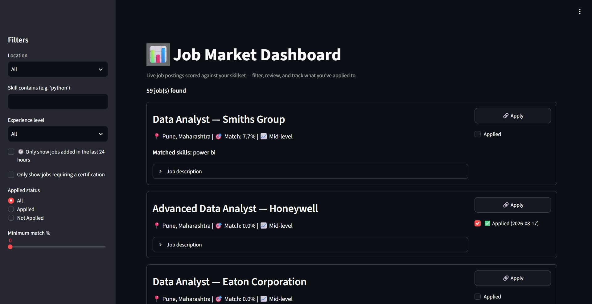

# Job Market Trend Tracker

An end-to-end job search tool: a pipeline pulls live postings from the Adzuna API, scores them against your skillset, detects certification requirements, and stores everything in a **PostgreSQL** database (hosted free on [Neon.tech](https://neon.tech)).

That database powers a **Streamlit dashboard** (`app.py`) where you can filter jobs by location, skill, experience level, and certification requirement, see a match %, and mark jobs as "Applied" with one click.

A **GitHub Actions workflow** (`.github/workflows/fetch-jobs.yml`) runs the pipeline automatically every 4 hours, so the dashboard stays up to date without you needing to run anything manually.

The Streamlit dashboard is deployed live on **[Render](https://render.com)**.

## Live demo

🔗 **[View the live dashboard](https://job-market-tracker-4owx.onrender.com/)**



## Project structure

```
job-market-tracker/
├── config.py             # Loads API keys + DB URL from environment variables
├── database.py           # PostgreSQL schema, insert/read/update logic
├── fetch_jobs.py          # Pulls postings from Adzuna, scores + saves new ones
├── app.py                 # Streamlit dashboard
├── mysql_queries.sql      # MySQL-equivalent schema/queries (reference only — see note below)
├── requirements.txt
├── .github/workflows/
│   └── fetch-jobs.yml     # Runs fetch_jobs.py automatically every 4 hours
└── .gitignore
```

## How it works

1. **`fetch_jobs.py`** calls the Adzuna API for job postings matching a search keyword and location.
2. Each posting is scored against a skills list (`MY_SKILLS` in `config.py`) to produce a match %, checked for certification keywords, and given a rough experience-level guess.
3. It also tries to resolve a direct employer application link instead of Adzuna's own redirect page.
4. New postings (deduplicated by `adzuna_id`) are saved to PostgreSQL via `database.py`.
5. **`app.py`** reads from the same database and displays each job as a card — with filters for location, skill, experience level, certification requirement, minimum match %, "added in the last 24h", and applied status.
6. Ticking "Applied" on a card calls `mark_applied()`, which updates the database immediately.

## Setup

1. Install dependencies:
   ```
   pip install -r requirements.txt
   ```
2. Get free Adzuna API credentials at https://developer.adzuna.com/
3. Create a free Postgres database at https://neon.tech and copy its connection string.
4. Create a `.env` file in the project root:
   ```
   ADZUNA_APP_ID=your_real_id
   ADZUNA_APP_KEY=your_real_key
   DATABASE_URL=your_neon_connection_string
   ```
5. Pull jobs into the database:
   ```
   python fetch_jobs.py
   ```
6. Launch the dashboard:
   ```
   streamlit run app.py
   ```

## Automated updates (GitHub Actions)

`fetch_jobs.py` runs automatically every 4 hours via GitHub Actions — no need to run it manually. The workflow reads `ADZUNA_APP_ID`, `ADZUNA_APP_KEY`, and `DATABASE_URL` from **GitHub repo Secrets** (Settings → Secrets and variables → Actions), so no key is ever exposed in the code. It can also be triggered manually from the Actions tab.

## Keeping API keys safe

- Real keys only ever live in a local `.env` file (excluded via `.gitignore`) or in GitHub/Streamlit Cloud's secrets managers — never typed directly into code.
- `config.py` reads everything through `os.getenv(...)` and fails loudly if a required key is missing.
- Deploying the Streamlit app publicly? Use Streamlit Cloud's **Secrets manager** (Settings → Secrets) instead of `.env`.

## Database note: PostgreSQL vs MySQL

The deployed app uses **PostgreSQL** (via Neon.tech's free tier). A MySQL-equivalent schema and set of queries (`mysql_queries.sql`) is also included in this repo to demonstrate familiarity with MySQL syntax — it is not used by the running app.

## Ideas to make the dashboard even better

- A "Notes" text box per job (e.g. why you applied, referral contact)
- A weekly email/summary of new high-match jobs
- Sorting by match % or date posted
- A simple bar chart at the top of the Streamlit app (jobs by location)
- A "Saved for later" status in addition to Applied
